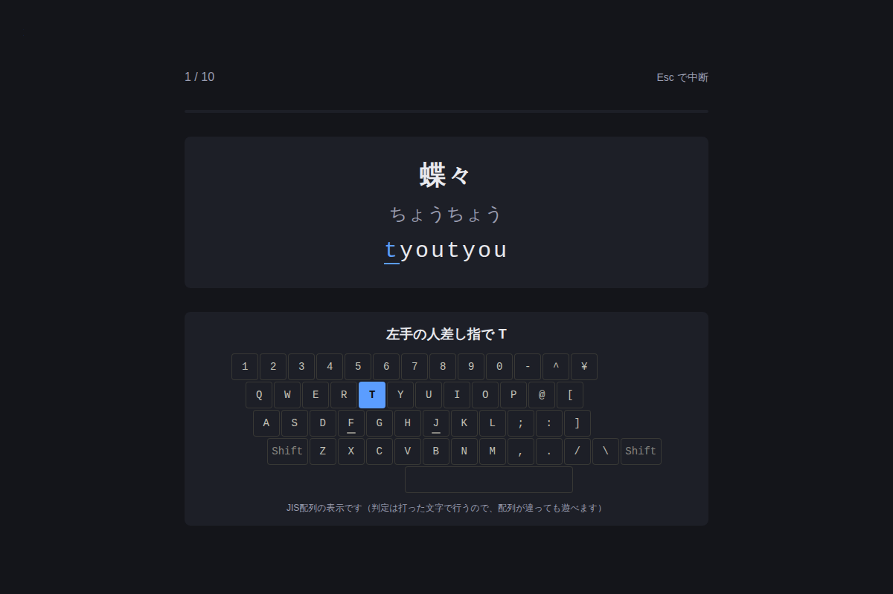
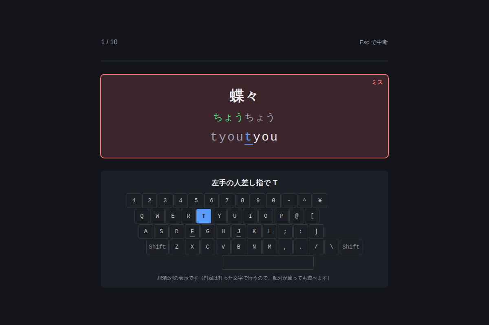
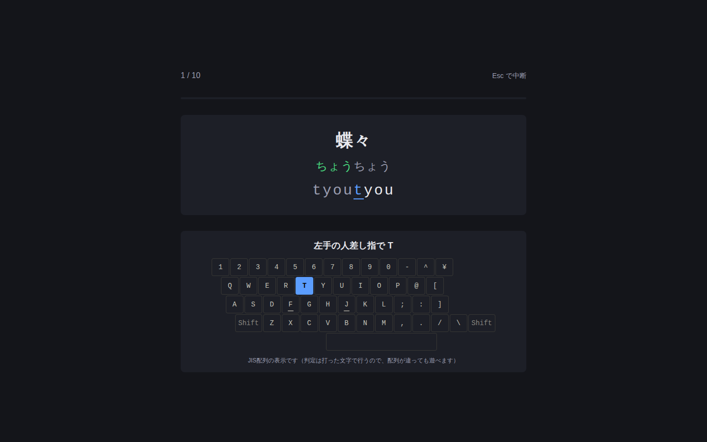

# 練習画面（ベース）のデザインレビューとアップグレード計画

対象: 標準テーマの練習画面（`Play` / `TargetView` / `FingerGuide`）。最終更新 2026-09-30。
撮影: `node scripts/shot.mjs playBase`（開始直後・入力の途中・ミス直後・1440px・390px の 5 枚）。

| 開始直後 | ミス直後 | 広い画面（1440px） |
|---|---|---|
|  |  |  |

## 1. デザイナー視点のレビュー

### 良いところ（残す）
- **情報の階層は正しい**: 上から「進捗 → お題 → 指の案内」。次に打つキーが、ローマ字（青い下線）とキーボード（青い塗り）の**2か所で同じ色**に揃っている。
- **ミスは色だけに頼らない**: 「ミス」の文字＋枠＋背景。誤打のたびに読み上げない配慮も良い。
- **打ち終えた読みは緑、進行中は灰、次の1文字は青**と、状態が3段階で読める。
- 運指は「左手の人差し指で T」と**文字でも**言っている。判定と表示が分離されている。

### 課題（優先度順）
**A. 主役が主役に見えない（最大の課題）**
1. **お題のカードが小さい**。1440px の画面で、お題は 700px 幅の箱の中。表示語 `text-4xl`（36px）・ローマ字 `text-3xl`（30px）は、視線の**焦点**としては弱い。練習中に一番見る文字なのに、画面の中央に**余白が大量に余っている**。
2. **3枚のカードが同じ濃さ・同じ形**（進捗の細い線、お題、キーボード）。どれも同格に見え、視線の行き先が決まらない。お題だけが立体的（明るい面・影・光）であるべき。
3. **背景が完全にフラット**（`#14151a` 一色）。ホームで入れた「アクセント色の淡い光」が練習画面には無く、画面間で別のアプリに見える。

**B. 打鍵の手応えが無い（「タイピングゲーム」らしさの不足）**
4. **正しく打った瞬間のフィードバックが無い**。打った文字は灰色に**暗くなる**だけ（褒められるのでなく、消えていく見え方）。キャレット（青い下線）が次へ**瞬間移動**するだけで、滑らかさが無い。
5. **キーボード図に「押した」表現が無い**。次のキーが光るだけで、押したキー（特に誤って押したキー）が見えない。ミスしたとき「何を押してしまったか」「正しくは何か」が図から分からない。
6. **お題が切り替わるとき、何も起きない**（文字が入れ替わるだけ）。区切り・達成感が無い。
7. ミスの表現が**重い**: カード全体が赤茶色に染まる。連続でミスすると画面全体が濁って見え、かえって焦りを生む。誤打したキーとその位置に絞った、軽い表現にしたい。

**C. 成績が見えない**
8. **練習中に「いまの速さ・正確さ」が分からない**。分かるのは「1 / 10」だけ。結果画面まで自分の状態が分からない。集中を削がない、**小さく静かな**ライブ表示が要る。
9. **進捗バーが細く目立たない**（4px の線）。10語のうち何語目かは、点や区切りのほうが読みやすい。
10. ヘッダーの「Esc で中断」が小さく薄い。中断＝記録が残らない（途中終了）のか分かりにくい。

**D. 運指ガイド**
11. 図は**全部が同じ無彩色**。どの指の担当かは文字にしか無く、図を見ても指が分からない。指ごとの色分け（＋形/ラベルで、色だけにしない）と、ホームポジションの手の位置が見えると、学習の効果が高い。
12. 図の下の注記「JIS配列の表示です（判定は…）」は**毎回読まされるノイズ**。設定に置くか、ツールチップにしてよい。
13. 図は 36px のキーで、**画面の大きさに対して小さい**。広い画面では大きくしてよい。

**E. レイアウト・レスポンシブ**
14. 縦方向の重心が**やや上寄り**（余白が上に 100px 以上）。お題を視覚の中心（画面の 40% 付近）に置きたい。
15. 390px 幅では、図が消えて（意図どおり）文字だけになるが、**お題の周りが余り、指の名前の箱だけが残る**。狭い画面でも整った見え方にしたい（PC 専用アプリなので優先度は低い）。

### 守るべき制約（この計画のすべてに適用）
- 打鍵の**判定・計測に触れない**。演出は描画だけ（`docs/adr/0001`）。**キー入力から描画までを遅らせない**（入力処理と描画を分ける）。
- **色だけで意味を伝えない**。点滅させない。「動きを減らす」と演出の強さ（標準/控えめ/オフ）に従い、**基本の見た目を「最後の姿」にして、動きは `@keyframes` で足す**。
- 既存のアクセシブルな名前（`お題` / `ローマ字ガイド` / `運指ガイド` / `進捗` など）を**変えない**（E2E と読み上げが依存）。装飾は `aria-hidden`。
- 色・フォントは `src/index.css` のトークンから作る（テーマで配色が変わっても追従）。新しい色を直書きしない。
- 配信量の予算（`docs/budget.json`）を超えない。画像は使わず、CSS/SVG で作る。

## 2. アップグレード計画

方針: **「主役を大きく・手応えを足し・成績を静かに見せる」**。既存のホーム画面で作ったカード/光/トークンを共通化し、画面間で1つのアプリに見せる。段階ごとに、撮影で確認し、E2E・axe を通してから次へ進む。

### U1 焦点をつくる（レイアウトと型）— 規模 中
- お題を**画面の主役**にする: 表示語 `clamp(2.5rem, 5vw, 4.5rem)`、ローマ字 `clamp(2rem, 4vw, 3.25rem)`、読みはその中間。長い文は現行の段階縮小を維持（`sizeClasses` を拡張。テストあり）。
- 全体を**縦方向の中心**（40% 付近）に。コンテナは `max-w-4xl` に広げ、お題カードは `.card`（境界・影・淡いグラデ）に統一。指の案内は一段引いた面（`.card` の弱い版）にして、**階層を作る**。
- **背景**に、ホームと同じアクセント色の淡い光（`.home-bg` の練習版。お題の後ろに集中する）を敷く。
- ローマ字の**打ち終えた部分**を、灰色に暗くするのをやめ、**明るい前景色のまま少し細く**（または `--color-success` の淡い色）にして、「消える」でなく「積み上がる」見え方に。次の1文字は現行の青＋下線に、**太字と淡い塗り**を足す。
- 完了条件: 撮影（1440 / 1280 / 390）で焦点が読める／`sizeClasses` のテスト更新／既存 E2E が無変更で通る／axe。

### U2 ライブ HUD（静かな成績表示）— 規模 小〜中
- 進捗バーを**語ごとの区切り**（10語なら10個の小さな刻み。完了・現在・未来を形と文字で）に。「1 / 10」は残す。
- ヘッダーに小さく **速さ（打鍵/分）・正確率・ミス数・経過時間** を並べる。数字は等幅・小さめ・低コントラストの補助色（**目に入るが視線を奪わない**）。設定「練習中の数字を隠す」で非表示にできる（集中したい人向け）。
- 計算は**純関数** `liveMetrics(keystrokes, now)`（`metrics` に置き、変異テスト）。更新は打鍵ごと＋1秒ごと。読み上げ（`aria-live`）にはしない。
- 「Esc で中断」を、ボタン風の**「中断（Esc）」**にし、「記録は残りません」の一言（実際の挙動に合わせて確認して書く）。
- 完了条件: 純関数の表テスト＋変異／画面のテスト／設定の保存／E2E／axe。

### U3 打鍵の手応え（描画だけの演出）— 規模 中
- **キャレット**: 次の文字への移動を、`transform` の短い（80ms）トランジションで滑らかに（基本の見た目は移動後の位置）。
- **キーボード図に「押した」表現**: 直前に押したキーを**輪郭の光**で 120ms（正: 淡い緑の輪＋✓ではなく形の変化、誤: 押した実キーに赤い×印＋**正しかったキーの枠が脈打つ**）。誤打は、図のうえで「押したキー」と「正しいキー」の**2か所**が分かるように。
- **正打の微小な反応**: 打った文字が 1 段ふくらんで戻る（`scale 1.06 → 1`、100ms）。演出「控えめ」では動かさず、色/太さの変化だけ。
- **ミスを軽く**: カード全体の赤茶色をやめ、**枠の赤と「ミス」ラベル**と、期待した1文字への強調だけにする。連続ミスで濁らない。揺れは「標準」のみ・2px・120ms。
- **語の切り替え**: 完了した語が上へ薄れ、次の語が下から入る（160ms、`opacity`＋`translateY`）。演出「オフ」では即時。
- 実装方針: 各要素にキー（`key={index}`）を与えて再生を制御し、状態は **data 属性**（`data-hit` / `data-miss`）で持つ。React の再描画は打鍵で1回のまま。
- 完了条件: 演出の強さ3種で挙動を確認（テスト＋撮影＋動画ではなく静止画の連番）／「動きを減らす」で動かない／**打鍵→描画の遅延を計測して悪化させない**（`performance.now()` の差を E2E で記録）／axe。

### U4 運指ガイドの強化— 規模 中
- 図を**指ごとの担当色**で薄く塗り分け、同時に**指のラベル（小指・薬指…の頭文字）**をキー左上に小さく（色だけにしない）。次のキーだけが明るく強調される。
- **ホームポジション**の手（F と J の突起＋左右の手の輪郭）を、SVG の簡素な線画で。次の指が**動く方向**を小さな矢印で示す（ホームから遠いキーのとき）。
- キーの大きさを画面幅に応じて拡大（`CELL` を CSS 変数化。最大 44px）。
- 注記「JIS配列の表示です…」は削除し、設定画面の説明とツールチップ（`title` ではなくボタンの `aria-describedby`）に移す。
- 完了条件: `layout.test.ts`（全文字がちょうど1通り）が通る／指の色は `dataviz` の検証を通す（色覚多様性でも隣の指が区別できる。ラベルで補う）／E2E・axe／狭い画面で図が崩れない。

### U5 お題の周りの「空気」— 規模 小〜中
- お題カードの背後の光を、**リズム**（直近の連続正打）で、ゆっくり強める。標準テーマでは**色を変えず明るさだけ**（テーマの手応え `feel` の段階とは別。`feel` のあるテーマでは既存の段階を使い、二重にしない）。
- 語を打ち終えた瞬間、カードの縁が**1回だけ**淡く光る（点滅ではなく、光って戻る 1 回）。
- 全体に、静かな微粒子ではなく、**縁のビネット**（周辺をわずかに暗く）で視線をお題へ。
- 完了条件: 撮影／演出の強さ3種／点滅や高速な明滅が無いこと（1秒に3回以上の輝度変化が無い）／axe。

### U6 仕上げと計測— 規模 小
- 中断・完了の遷移（練習 → 結果）を、軽いフェード（120ms）で。
- 結果画面の見た目を、ホームのカード表現に**そろえる**（別作業として計画。この計画では枠だけ確認）。
- **性能の実測**（打鍵→描画、長い文、演出オン/オフ）と、`docs/a11y.md` の更新。
- 実機での確認項目を `docs/manual-check.md` に追加（オーナー: 目の疲れ・動きの好み・キー入力の遅延の体感）。

### 進め方・順序
1. **U1 → U2 → U3 → U4 → U5 → U6**。各段階で「撮影 → 変更 → 撮影 → E2E/axe → 文書」（`docs/WORKFLOW.md`）。1段階＝1コミットで、`main` への反映は依頼があったとき。
2. U1 と U2 は**見た目の土台**なので先に。U3 は体感に効くが、設定（演出の強さ）と密接なので U1 の後。U4 は独立（並行可）。
3. 各段階の前後で同じ撮影（`playBase`）を撮り、`docs/design/img/` に Before/After を置く。
4. **オーナーに確認したい点**: (a) 練習中の数字（U2）は既定で出すか隠すか、(b) キー図の指ごとの色（U4）は使うか（無彩色のままが好みか）、(c) 正打のふくらみ（U3）は好みが分かれるので既定を「控えめ」にするか、(d) 背景の光（U1・U5）の強さ。
5. リスク: 演出の足しすぎで**集中を削ぐ**。各段階で「オフ」と「控えめ」を先に確かめ、標準でも静かな設計にする。
